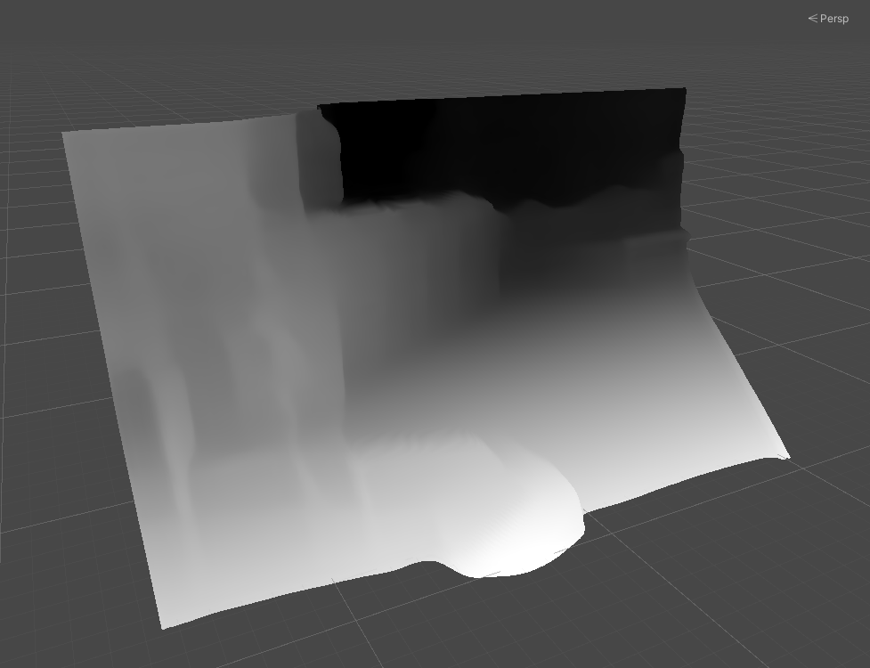
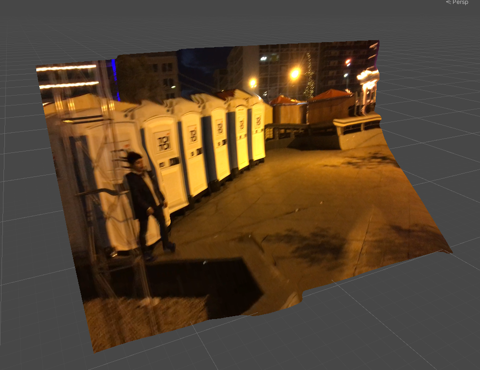
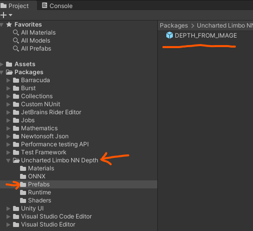
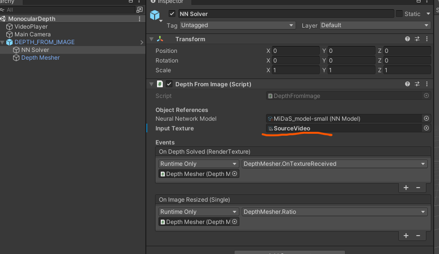
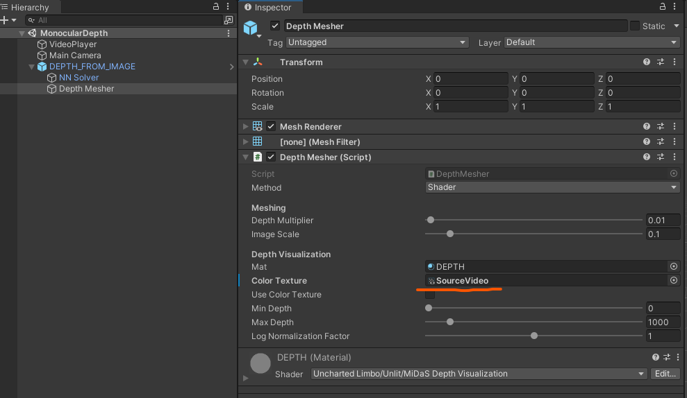

# monocular-depth-unity
 Real-time **Depth from Monocular Image** using the [MiDaS v2](https://github.com/intel-isl/MiDaS) library with Unity's Barracuda inference framework.  
 
 This project includes the correct .onnx model that works well with Barracuda.  
 
 See discussions that led to this choice [here (Unity)](https://github.com/Unity-Technologies/barracuda-release/issues/187#issuecomment-856702114) and [here (Intel ISL)](https://github.com/intel-isl/MiDaS/issues/113#issuecomment-856693837). (June 2021)




## Requirements
|Platform|Version|
---|---
|Unity|2021.1|
|com.unity.barracuda|2.1.0-preview|

## Installation

### Unity Package Manager
Add this line to your `manifest.json`:
```json
"ulc-nn-depth":"https://github.com/GeorgeAdamon/monocular-depth-unity.git?path=/MonocularDepthBarracuda/Packages/DepthFromImage#main",
```

## Usage

### Step 0
Find the `DEPTH_FROM_IMAGE` prefab  


### Step 1
Use the Texture you like in the `Input Texture` slot. Works with RenderTextures and Texture2D objects. Video is supported through RenderTextures.  


### Step 2
Parameterize the visual output in the `Depth Mesher` object. Use `Shader` method for best performance, or `Mesh` to get an actual tangible mesh.
If `Color Texture` is left blank, the mesh will be colorized with the depth data by default.  

